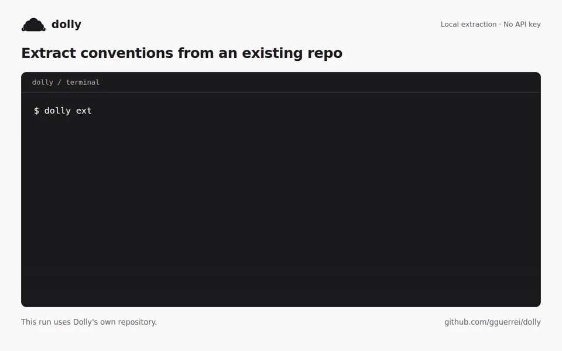
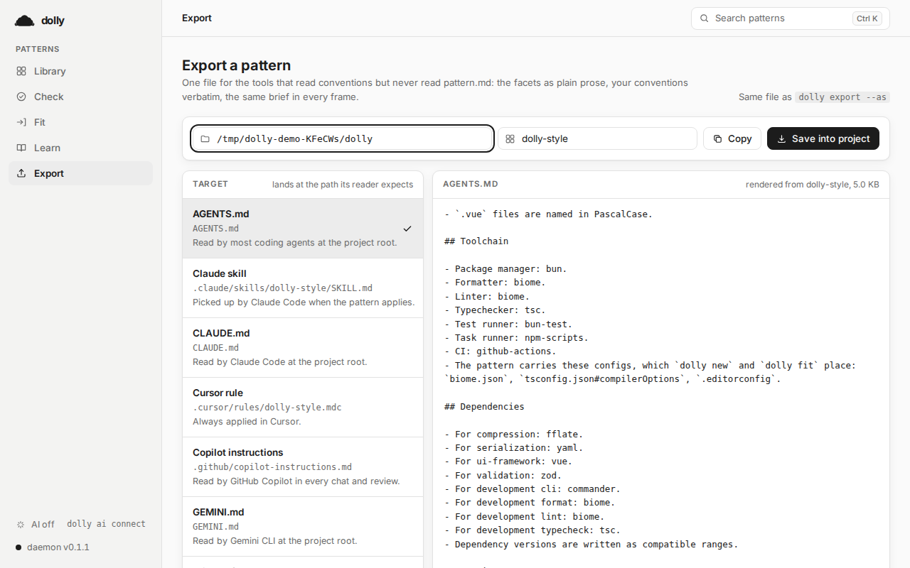

<p align="center"></p>

<h1 align="center">dolly</h1>

<p align="center">Extract your repo's conventions. Share them with your coding agent. Check for drift.</p>

<p align="center">
  <a href="https://github.com/gguerrei/dolly/releases/latest"></a>
  <a href="https://www.npmjs.com/package/dollysheep"></a>
  <a href="https://github.com/gguerrei/dolly/actions/workflows/ci.yml"></a>
  <a href="LICENSE"></a>
</p>

dolly reads an existing repository and saves its layout, configs, naming conventions, test setup, and commands as a reusable *pattern*. Export that pattern as instructions for your coding agent, use it to start another project, or check existing projects against it.

Extraction and the standard checks run locally, without an LLM or an API key. You can inspect and edit everything dolly saves.

[](assets/demo.mp4)

[Watch the MP4](assets/demo.mp4) · [Read the walkthrough](docs/demo.md)

## Install

On a Mac with Apple silicon:

```sh
brew install gguerrei/dolly/dolly
```

The [standalone CLI](docs/install.md) also runs on Linux x64 and Windows x64. It includes the GUI and needs no separate runtime. [Desktop installers](https://github.com/gguerrei/dolly/releases/latest) are available for all three platforms.

If you already use [Bun](https://bun.sh), install the npm package:

```sh
bun add -g dollysheep
```

The npm package requires Bun >= 1.2, including when installed through `npm install -g`. See the [installation guide](docs/install.md) for commands and checksum verification.

## Try it

Run these commands inside a repository you know well:

```sh
dolly extract . --name my-style
dolly show my-style
dolly export my-style --as agents-md
```

`extract` saves the pattern in your local library. `show` lets you review the inferred conventions and the notes about anything dolly could not establish. `export` writes `AGENTS.md` in the current directory. It refuses to replace an existing file; use `--out AGENTS.dolly.md` to inspect a separate copy.

You can export the same pattern for Claude Code or Cursor:

```sh
dolly export my-style --as claude-md
dolly export my-style --as cursor
```

Exports also support Claude skills, Copilot, Gemini, Windsurf, Cline, and a plain prompt. The [usage guide](docs/usage.md#agent-instructions) lists every output path.

## Catch changes to your conventions

```sh
dolly check my-style
```

For example, if a pattern records `bun test` as the test command and a project changes that script, dolly reports the difference:

```text
commands package.json: script "test" differs from the pattern's `bun test` [fixable]
```

This is an excerpt from the [demo run](docs/demo.md). The command exits with status 1 when an error remains, so you can use it in CI. `--watch` repeats the check as files change, and `--json` produces a report for other tools. `--fix` creates missing files, appends entries, and merges pattern values while preserving unrelated settings.

The checks cover concrete rules such as layout, naming, configs, commands, and test placement. Prose conventions can travel in agent instructions; reviewing those with a model is [optional](docs/usage.md#optional-ai).

## Reuse a pattern

```sh
dolly new my-style ../next-project
dolly check -C ../next-project
```

The new project gets the pattern's layout, captured configs, templates, and commands. A `.dolly` marker remembers its pattern. You can also [share a pattern](docs/usage.md#share-a-pattern) or [plan changes to an existing project](docs/usage.md#fit-an-existing-project).

## Open the GUI

```sh
dolly serve --open
```

Browse patterns, inspect the generated instructions, and check projects from the same local interface. The desktop app opens this interface in a native window.



## In CI and hooks

Vendor the pattern once and commit it with your project so CI can find it:

```sh
dolly link my-style --vendor
dolly check
```

The repository also provides a [pre-commit](https://pre-commit.com) hook. It uses the `dolly` executable on your PATH:

```yaml
- repo: https://github.com/gguerrei/dolly
  rev: v0.1.1
  hooks:
    - id: dolly-check
```

Use `dolly ignore` and `dolly rules` to record intentional exceptions. The [usage guide](docs/usage.md#checks-and-exceptions) explains how they affect the result.

## Security

dolly does not follow symlinks, and exported patterns exclude credentials. The GUI listens on localhost and requires a session token. Releases include `SHA256SUMS` for verification. See [SECURITY.md](SECURITY.md) for the trust model and reporting instructions.

## Development

Requires [bun](https://bun.sh) >= 1.2.

```sh
bun install
bun test                          # the test suite
bun run check                     # Biome lint and format
bun run typecheck                 # tsc, strict
bun run --cwd apps/desktop build  # vue-tsc and the webview
bun run --cwd apps/desktop e2e    # the GUI walked in Chromium (after the build; Chromium once via bunx playwright install chromium)
bun run dolly list                # the CLI from source
```

```
packages/core   # @dollysheep/core: the engine (pattern model, extract, new, check, fit, learn, the AI adapters)
packages/cli    # dollysheep: the `dolly` command, including the `serve` daemon
apps/desktop    # the GUI webview (Vue 3), served by `dolly serve`, and the Tauri shell (src-tauri/)
packaging       # the Homebrew formula
```

## Feedback

Try dolly on a repository you know well and [tell us what it gets wrong](https://github.com/gguerrei/dolly/issues). Incorrect inferences, missing conventions, and confusing setup steps are especially useful reports. A Linux AppImage is planned; feedback from the first users will guide what follows.

## Contributing

Contributions are welcome: issues, ideas, and PRs alike. Start with [CONTRIBUTING.md](CONTRIBUTING.md) for setup and conventions (Conventional Commits); the [Code of Conduct](CODE_OF_CONDUCT.md) applies everywhere in the project.

## License

[MIT](LICENSE). Named after Dolly the sheep: the pattern captures how you build software, so you can use it again.
