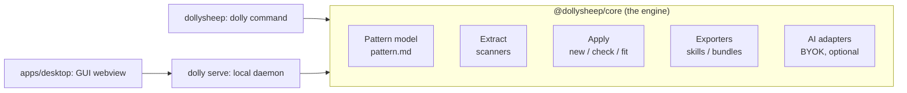

# dolly: Implementation Plan

> The living roadmap. Update the [session log](#session-log) at the end of every working session.

## Vision

dolly saves **project organization patterns** (everything that makes *your* projects yours) and applies them anywhere. A pattern captures anything from a ruff config to an entire architecture: folder layout, naming conventions, dependencies, code style, the natural language your docs are written in, and which programming language a given kind of functionality is written in.

The name is a nod to Dolly the cloned sheep: you clone how you build software.

## Product pillars

1. **Non-declarative capture.** `dolly extract` infers a pattern from a real project deterministically: no annotations, no flags. Declarative statements are a last resort for the few things inference can't reach.
2. **Patterns are plain files you own.** Human-editable, diffable, deletable. No lock-in, no database.
3. **Three ways to apply.** Scaffold a `new` project, `fit` an existing one, or `check`/`--watch` continuously like a linter.
4. **AI is optional, never required.** Everything deterministic works with AI off. With AI on (BYOK), dolly gains semantic placement, cross-language translation, and a passive learning mode.
5. **Patterns travel.** Export as skills/agents for any LLM, or as a `.dolly` bundle to share with your team.

## How visual work happens

A maintainer rule since 2026-08-21: anything a person will look at (the mark, a GUI view, an empty state, installer and docs visuals) is designed before it is built, on a Claude Design canvas (`/design`), and approved there. The canvas is the place to compare directions and tweak by hand; code follows the approved board, and the port is reviewed against it. Canvas links are recorded in [docs/design/gui.md](design/gui.md) so a later session can reopen the source of a screen. The brand sheet and the four app views that the 2026-08-21 redesign shipped from are the first entries. Every milestone below that adds a surface names its design step explicitly.

## Architecture



- **`packages/core`**: all logic. No CLI or GUI concerns ever leak in here.
- **`packages/cli`**: thin commander layer over the engine. Every feature ships here first. `dolly serve` lives here too: the engine's one door for the GUI (design in [docs/design/gui.md](design/gui.md)).
- **`apps/desktop`** (M5): the GUI webview (Vue 3 + Vite), served by the daemon so CLI/GUI parity holds by construction, plus the Tauri shell (`src-tauri/`) that wraps this exact pair: it spawns `dolly serve` and points the window at the tokened URL (steps in `apps/desktop/README.md`).
- **AI adapters** (M7): one provider interface, implementations for Anthropic / OpenAI / Google. Keys in the OS keychain.

## The pattern model

A pattern is a **directory**; sharing one means zipping it (`.dolly` bundle).

```
<name>/
├── pattern.md      # the pattern itself
└── templates/      # optional file templates captured for scaffolding
```

`pattern.md` = YAML frontmatter + Markdown prose (see ADR-0002):

- **Frontmatter**: the *facets* the deterministic engine understands. Grows facet by facet:

  | Facet | Contents | Extract | Check | Scaffold |
  |---|---|---|---|---|
  | `naming` | case conventions for files/dirs, global + per-extension | majority vote | ✓ | ✓ |
  | `layout` | expected paths, required/optional, `{name}` templating | tree generalization + sibling voting | ✓ | ✓ |
  | `toolchain` | package manager, formatter, linter, typechecker, test/task runner, CI + captured config files | fingerprint matrix | ✓ | ✓ |
  | `languages` | sanctioned languages (ordered), runtime version pins, natural language of docs | lookup + corpus vote | ✓ | ✓ |
  | `dependencies` (M1) | libraries by purpose, version policy | manifest parsing + curated registry | ✓ | ✓ |
  | `scaffold` (M3) | file templates + variables | sibling-agreement capture | n/a | ✓ |
  | `commands` (M3) | canonical dev verbs (test, lint, build…) | script/taskfile parsing | ✓ | ✓ |
  | `license` (M3) | SPDX id | manifest field + LICENSE fallback | ✓ | ✓ |
  | `testing` (M4) | test placement + file pattern | placement + naming-shape vote | ✓ | n/a |
  | `commits` (M8) | message style, types, scopes, subject case | git-log vote under ADR-0005's exception | n/a (hooks and exports carry it) | n/a |
  | `releases` (M8) | versioning scheme, changelog style, release tool | tag vote (ADR-0005) + root fingerprints | ✓ (changelog, tool config) | ✓ (changelog header) |

  Extraction rules (the shared inventory, evidence classes, facet-vs-prose
  degradation, and format fluidity until M9) are recorded in
  [ADR-0003](adr/0003-deterministic-extraction.md) and detailed in
  [docs/design/extract.md](design/extract.md).

- **Prose**: the *conventions* only humans and the AI layer can interpret ("raise domain errors, translate to HTTP at the router layer"). The deterministic engine ignores it; exports and AI consume it.

## CLI surface (target)

```
dolly extract [paths...] --name <n> # infer a pattern from a project, or what several agree on (M2, done; several 2026-09-01)
dolly list | show | edit | delete # manage saved patterns               (M0/M1, done)
dolly new <pattern> [dir]         # scaffold a fresh project            (M3, done)
dolly check [--fix] [--watch]     # lint-like enforcement               (M4, done)
dolly serve [--port] [--open]     # local daemon + browser GUI          (M5, done)
dolly fit <pattern> [--apply]     # refit an existing project, dry-run default (M6, done)
dolly export <pattern> [--as t] [--out f] # a .dolly bundle, or a skill/rule/AGENTS.md/prompt (M1 + M8, done)
dolly import <file-or-url> [--force] # import a shared pattern         (M1, done; URLs 2026-09-01)
dolly link <pattern> [-C dir]     # write the .dolly marker into an existing project (2026-09-01, done)
dolly ai [status|connect|use|off] # BYOK provider setup                 (M7, done)
dolly learn [pattern] [--once] [--yes] # watch a project, review drafted pattern edits (M7, done)
```

## Milestones

> **Release policy (maintainer decision, 2026-07-24):** the repo goes public on GitHub only once M1 through M8 exist as a complete end-to-end first draft. Until then, everything stays local.

- **M0: Bootstrap** *(done 2026-07-24)*: monorepo (bun + Biome + strict TS), pattern format v1 + local store in `@dollysheep/core`, `dolly list/show/delete/home`, OSS hygiene (LICENSE, README, CONTRIBUTING, CoC, SECURITY, templates), CI, logo, this plan, ADRs 0001 and 0002.
- **M1: Pattern ergonomics** *(done 2026-07-24)*: full v1 facet schemas incl. `dependencies`; `dolly edit` (opens `$EDITOR`, validates on save); great validation errors; `.dolly` bundle import/export (pulled forward from M8).
- **M2: Extract** *(done 2026-07-24)*: the shared inventory walk plus five deterministic scanners (layout sibling-shape voting, naming majority vote, toolchain fingerprint matrix with configs captured as files, dependency manifests + purpose registry, language/runtime detection incl. natural language of docs), one consolidated schema diff (ADR-0003), `dolly extract [path] --name`. Low-confidence findings land in prose as counted notes, not facets. **Acceptance:** extracting from 3 real repos yields patterns a human agrees with after light editing.
- **M3: New** *(done 2026-07-24)*: scaffold a project from a pattern (layout, configs, templates with variable substitution, base-manifest generation, git init). Adds the `commands` facet (canonical dev verbs, written into the scaffolded manifest/taskfile) and the `license` facet (SPDX id; new stamps LICENSE + the manifest field). **Acceptance:** extract from a real repo → `dolly new` → the fresh project passes its own pattern's `check` and its linter, and runs its canonical commands.
- **M4: Check** *(done 2026-08-11)*: rule engine mapping facets to violations with autofixes; `--fix`; `--watch` via fs events. Adds the `testing` facet (placement + file pattern), `toolchain.hooks` (husky/lefthook/pre-commit), the built-in env-hygiene rule (".env present but not gitignored"), the per-config binding modes (subset by default, verbatim opt-in via `toolchain.binding`), and the `.dolly` marker `dolly new` writes so `check` knows its pattern. **Acceptance:** seeded violations are found and fixed idempotently (fixing twice changes nothing).
- **M5: GUI shell** *(done: web-first 2026-08-12, Tauri wrap 2026-08-13)*: pattern library, pattern viewer/editor, project check dashboard, all in a Vue 3 + Vite webview reaching the engine only through the thin local daemon (`dolly serve`), white/black/grey sheep theme, wrapped in a Tauri window that spawns the daemon and dies with it. Still owed to the shell, at release time: directory pickers (which is when extract/new/import/export join the daemon protocol) and a compiled daemon bundled as a true sidecar (today the shell presumes a checkout with `bun`). **Acceptance:** browse, edit, and check visually; met in a browser end to end, then re-met in the native window.
- **M6: Fit** *(done 2026-08-13)*: migration planner (moves, renames, config merges) → dry-run diff → apply. Git safety: refuses a dirty tree, creates a checkpoint branch (`git switch` back is the undo), commits the applied plan. One maintainer decision shapes v1 ([docs/design/fit.md](design/fit.md)): relative TS/JS imports are rewritten where resolution is unambiguous; a move fit cannot account for degrades to report-only with its reason. **Its first PR (the structural refactor the 2026-08-11 architecture review sequenced here) landed the same day, before any fit logic:** check's fixes are serializable data (a create/append/merge `FixPlan` behind the one executor in `check/fix.ts`, plus `write` for the verbatim binding) with rules behind the single `Rule` contract in `check/rules/`, which is what gives fit its dry-run diff and the M5 daemon a JSON-safe `CheckReport`; the shared tree/serialization/content helpers live in named modules (`tree/`, `serialize.ts`, `apply/content.ts`); the taskfile recipe scanner is unified in `taskfile.ts`; `layout.ts` has direct unit tests so its voting constants are falsifiable. **Acceptance:** refit a deliberately messy repo; every change previewed first; fully revertible.
- **M7: AI layer** *(done 2026-08-22: foundation, placement, learning mode, translation, and the GUI's learn and AI settings surfaces)*. Provider adapters (Anthropic / OpenAI / Google), keychain storage, intelligent apply (semantic file placement done; cross-language translation when the pattern dictates a language, scoped 2026-08-22 as full translation behind apply, [ADR-0004](adr/0004-translation-behind-apply.md) and [docs/design/translation.md](design/translation.md)), learning mode (`dolly learn`, done: a watcher drafts pattern edits the user reviews as a diff). AI is strictly additive. Both GUI surfaces went through the canvas first (the learn view and the AI settings), and the fit view renders translate steps and the verification verdicts.
- **M8: Exports** *(done 2026-08-22: engine, CLI, daemon, and the GUI's export view, designed on the canvas first)*. `claude-skill`, `cursor` rules, `AGENTS.md`, generic system prompt, one brief in four frames ([docs/design/exports.md](design/exports.md)). (Bundle import/export moved to M1.) Adds the facets exports feed on most: `commits` (message grammar voted from git log under [ADR-0005](adr/0005-history-facets.md), the exception to ADR-0003) and `releases` (versioning scheme, changelog style, release tool); `naming.branches` was deferred, since one clone's local refs are not evidence of a convention. Design step: the **export view** on the canvas (pick a target, preview the rendered file, save or copy), approved and ported the same day.
- **M9: Going public & v0.1** *(the GUI's share done 2026-08-23: the native shell's pickers and the extract, new, import, and bundle export flows, designed on the canvas then ported; the rest below is release work)*. First public GitHub push, `bun build --compile` binaries (macOS/Linux/Windows), npm + Homebrew distribution, Tauri installers, docs polish, demo GIF, name-collision check on registries, v0.1.0 release. Design steps, each on the canvas first: the **native shell's directory pickers and the extract, new, import and export flows** they unlock (M5's debt), the **README and docs visuals** (hero, the demo's storyboard, social preview card), and the **installer and store assets** for the Tauri builds.

## Risks

| Risk | Mitigation |
|---|---|
| Refit deletes/moves the wrong thing | Dry-run by default, git-clean requirement, checkpoint branch (M6) |
| "dolly" name taken on npm/registries | Decided 2026-09-01: the npm package is `dollysheep` (`@dollysheep/core` for the engine), the bin stays `dolly`, and the Homebrew formula is `dolly` (free) |
| API keys leaking | OS keychain only, never config files; keys never enter patterns or exports |
| Scope creep | Facet-by-facet discipline; every milestone has acceptance criteria |
| bun-compiled binaries vs native deps | Prefer pure-TS/WASM deps (e.g. web-tree-sitter if ASTs are ever needed) |
| Windows path/fs quirks | CI test matrix includes Windows from day one |

## Prior art (and why dolly is different)

cookiecutter/copier scaffold from hand-written declarative templates; projen manages config declaratively; nx generators are ecosystem-bound; ruff/eslint enforce single-language style. dolly's bet is the combination: **extraction instead of declaration**, the full lifecycle (new/fit/check) instead of scaffold-only, cross-ecosystem patterns, and optional AI on top of a deterministic core.

## Decisions

Recorded as ADRs in [`docs/adr/`](adr/): [0001, TypeScript + bun + Tauri stack](adr/0001-typescript-bun-tauri-stack.md), [0002, pattern as Markdown document](adr/0002-pattern-as-markdown-document.md), [0003, the deterministic extraction contract](adr/0003-deterministic-extraction.md), [0004, cross-language translation behind apply](adr/0004-translation-behind-apply.md), [0005, the history facets and the exception they carve](adr/0005-history-facets.md).

## Session log

### 2026-07-24: M0 bootstrap
Repo created from scratch. Stack/license/MVP/AI decisions confirmed with the maintainer (see ADR-0001). Monorepo, pattern format v1, local store, `dolly list/show/delete/home`, tests, CI, hygiene docs, logo, this plan. A two-reviewer audit then hardened M0: `dolly home` now prints the data root, `list` keys on directory names and flags unparseable patterns instead of hiding them, `save` validates names, versions are `0.1.0-dev` pre-release, CLI got its own smoke tests, and the README gained a hands-on "Try it" loop. Next up: **M1** (facet depth, `dolly edit`, bundles).

### 2026-07-24: M1, pattern ergonomics
The v1 facet schema is complete: the `dependencies` facet captures libraries by purpose (runtime and dev) plus a version policy. `dolly edit` opens `$EDITOR` and validates on save, with a reopen loop in interactive terminals. Patterns now travel as `.dolly` bundles via `dolly export` / `dolly import --force`. A three-reviewer audit (coherence, clean code, adversarial security) hardened the result: imports validate the entire bundle before touching the store, oversized bundles are rejected before decompression, exports skip symlinks so a shared bundle can never leak outside files, broken patterns can still be deleted, and the store owns its directory layout in exactly one place. Full suite: 38 tests green. Next up: **M2 (extract)**.

### 2026-07-24: M2, extract
Designed first, built second. A twelve-agent design panel (five scanner designers, four gap hunters, three adversarial critics) produced [docs/design/extract.md](design/extract.md) and ADR-0003 before any code; the critics' findings (shared inventory, tool-identity ownership, generalization filters, required-flag corroboration) were baked into the implementation rather than patched in later. The result: one shared inventory walk feeding five pure scanners, `dolly extract [path]`, the consolidated schema diff (naming.extensions, languages restructure + versions, toolchain roles + configs-as-files, layout path refinement), and configs captured as real files under the pattern's `toolchain/` directory. Acceptance ran against dolly itself plus three real repos (a Nuxt full-stack app, a Python/uv library, a TS browser extension); each yielded a pattern a human would endorse after light edits, including correct refusals: a bilingual docs corpus got a note instead of a guessed `natural`, mixed naming got counted distributions instead of a wrong facet. Deferred facets (commands, license, testing, hooks, commits, releases) are now scheduled in their consuming milestones. Full suite: 52 tests green. A planned post-build multi-reviewer audit was cut short by session limits, and is worth running at the start of the next session. Next up: **M3 (new)**.

### 2026-07-24: M3, new
`dolly new` scaffolds a fresh project from a pattern: layout expanded with the documented `{name}` semantics sharpened: a `{name}` directory segment is a module template instantiated once, named after the project (deriving `workspaces` for the root manifest), while file-position `{name}` conventions are skipped and reported. Captured toolchain configs return to their source paths, embedded subtrees fold back into the manifests they came from, base manifests carry the two facets added this session (`commands`, canonical verbs from the resolved task runner's own file; `license`, SPDX id from manifest fields with LICENSE-text fingerprint fallback; both with extract support and honest degradations), LICENSE is stamped from stored texts, empty src/test directories get starter files so the toolchain has inputs, and git is initialized. The `scaffold` facet completes the milestone: templates are captured from the very `{name}` groups the layout scanner voted into existence, on an agreement bar: every member carries the file and the files are byte-identical once each member's own name becomes `{{name}}` and the package scope `{{project}}`, so a template can never carry the source project's identity into an unrelated one. One dissenting member is a counted note instead, which is exactly what dolly's own packages and ADRs produce. Templates live at `templates/<path>` as a mirror of the project tree, hand-editable, and `.dolly` bundles carry them for free. The design is recorded in [docs/design/new.md](design/new.md). A five-dimension audit (M3 correctness, hostile patterns, the deferred M2 extract audit, design coherence, code quality) confirmed seven findings, all fixed, the sharpest being an ISC fingerprint whose guard was satisfied by the word "DISCLAIMS", letting 0BSD stamp as ISC. Acceptance ran for real, twice: extract from the dolly repo itself → `dolly new` → the fresh project passes `biome check .`, `tsc --noEmit`, and `bun test`; then a uniform monorepo to exercise the capture path the dolly repo correctly refuses, confirming placeholder substitution end to end (`@uniform/api` → `@{{project}}/{{name}}` → `@flock/flock`) and the bundle round-trip. Full suite: 73 tests green. Session limits cut the audit's verification tail short; the unverified findings are logged in the workflow output if wanted. Next up: **M4 (check)**.

### 2026-07-24: logo rework + release policy
Logo redrawn as pure line art per maintainer feedback: one closed run of outward arcs forms the fleece, each end dips into a saddle then a head bump, U-shaped ears hang from the saddles at eye height, dot eyes; a `prefers-color-scheme` style inverts the stroke on dark backgrounds. Verified by rasterizing at full size, 140px, and on dark. Release policy recorded: public GitHub debut only after the M1 through M8 end-to-end draft.

### 2026-07-27: M3 wrap-up, the docs catch up with the engine
The engine had been running two milestones ahead of its own documentation. M3's acceptance was re-run first to confirm nothing had rotted: extract from this repo, then `dolly new` into a fresh tree (thirty entries, the `{name}` module instantiated once, `docs/adr/{name}.md` correctly skipped) against a green suite of 73 tests plus Biome and `tsc`. Then the paperwork. The README lists `extract` and `new` under "Here today" instead of the roadmap, and its "Try it" section now walks the real extract → show → new → export loop rather than telling readers to hand-write a `pattern.md` because extraction "isn't built yet"; every command printed there was run as written before it was published. The CHANGELOG, which still stopped at M1, gained entries for extract, `dolly new`, and the `commands`, `license` and `scaffold` facets. M2 is marked done in both the milestone list and the CLI surface table, where it had been left hanging.

Then the audit tail M3 never got: four agents, three finders (scaffolder, extract-side facets, quality and coverage) and one skeptic re-judging every finding against the code, surfaced nineteen defects that survived verification, all fixed. Two mattered most. A pattern could name `.git/config` as a captured config's source path; the file landed before `git init`, which keeps foreign keys, so a `core.fsmonitor` value executed the moment the user ran the `git add -A` dolly prints as its own next step. And template capture leaked identity: agreement on byte-identical siblings guarantees consistency, not safety, because whatever is constant across siblings (an author's email, a repository URL) survives the comparison by construction and shipped inside `.dolly` bundles. Both now degrade the way ADR-0003 demands. The rest clustered into four families: paths that skipped the safety guard (layout entries never reached it at all, and it now lives in one place all three path kinds share), precedence that contradicted [docs/design/new.md](design/new.md) (a generated justfile silently overwrote a captured template), fingerprints that could not separate a license from its no-attribution sibling (MIT-0 read as MIT, exactly the trap 0BSD set for ISC last session), and manifest values accepted unvalidated ("Proprietary" became a license facet). One bug was in the transpiler's mouth rather than the code's: a helper named `declare` had its call sites silently erased as ambient TypeScript declarations. Fourteen tests were added, the raw NUL byte that made `new.test.ts` unsearchable to grep became an escape, and acceptance was rerun: 87 tests green, and a fresh scaffold still passes `biome check .`, `tsc --noEmit`, and `bun test`. Next up: **M4 (check)**.

### 2026-08-11: review pass + M4, check
The session opened with the review the maintainer asked for: the previous session's fourteen still-unverified audit findings (their verification stage had died on a session cap, silently marking everything "refuted") were re-judged by hand against the code. Eleven were real and are fixed with a test each: the path gate now matches `.git` case-insensitively and survives Windows trailing-dot normalization, and `toolchain.configs` values pass the full gate so backslash traversal is refused; the license scanner treats family fingerprints (GPL, MIT-0-shaped, 0BSD-shaped) as candidate ids a manifest can genuinely disagree with (MIT-manifest-plus-GPL-text no longer emits a facet), and an unrecognized manifest declaration now silences a stray permissive LICENSE instead of being overruled by it; the commands filter sweeps to a fixpoint so dropping one verb also drops the verbs that ran it, counts direct `yarn <script>` invocations, and scans recipe bodies past blank lines instead of shipping half a recipe; the template identity gate reads Cargo.toml/pyproject/go.mod so non-npm captures are gated too; dissent notes count the largest agreeing group; a captured taskfile or LICENSE is never overwritten by generated content; a file that is another file's parent yields to the directory instead of crashing `writeTree` mid-scaffold; and a bare `{name}` layout file is per-resource, not an empty project-named stub.

Then M4, designed first in [docs/design/check.md](design/check.md) around three maintainer decisions taken this session: the project→pattern link is a committed `.dolly` marker written by `dolly new` (explicit argument wins), captured configs bind as **subsets** by default (captured keys present and equal, project extras welcome; `toolchain.binding` opts a config into verbatim bytes), and `--watch` is a plain debounced full re-run that refuses to combine with `--fix`. The engine maps eight rules over the same shared inventory extract uses (layout, naming, config binding, commands, license, testing, hooks, env hygiene), each violation carrying at most one autofix, and fixes only ever create, append, or merge: renames and moves stay `fit`'s job, license text is never replaced, a root manifest is never invented, and a config whose comments a rewrite would destroy degrades to a report. The env rule is the inventory leaning on itself: the walk applies `.gitignore`, so "the walk can see `.env`" *is* the violation, and the fix appends one line. Two facets landed with extract support: `testing` (placement + `{stem}` naming shape, both by 80% vote) and `toolchain.hooks` (husky/lefthook/pre-commit fingerprints). Acceptance ran as designed: a fresh scaffold passes its own pattern's check through the marker alone, and five seeded violations across five rules are found, fixed, and a second `--fix` changes nothing, plus a live CLI loop (extract → new → check → break → fix → clean, exit codes and all) and a `--watch` smoke. Full suite: 113 tests green.

The two soft spots the build left were then closed the same day, per maintainer decisions. Config binding gained a third mode, `presence` (the file exists, its contents are the project's own), and the byte-equality fallback for non-JSON/TOML captures became report-only; the M4 build had shipped it with an overwrite fix, which contradicted check's own ground rule 4 the moment a team edited a captured `.editorconfig`; only explicit `verbatim` overwrites now, while a *missing* file keeps its create-fix in every mode because creation cannot lose work. And `new` now consumes the `testing` facet when seeding starter tests, split along ADR-0003's ownership line: the test runner owns the seed's contents, the facet its name and placement, so `filePattern: "{stem}.spec.ts"` names the seed `index.spec.ts`, and a colocated pattern seeds next to the entry file instead of waiting for a test directory its layout doesn't have. Before this, a spec-named or colocated pattern scaffolded a seed that violated its own pattern's check. Full suite: 118 tests green. Next up: **M5 (GUI shell)**, with `fit` groundwork as the alternative smaller start.

### 2026-08-11: full-project architecture review, and the fixes it demanded
With M0 through M4 built, the maintainer asked for a health check of the whole codebase (bugs, architectural clarity, open-source readiness) before more code lands on top. Three viewpoints ran independently (an inline pass plus two review agents, every claim re-verified against the code before being believed): unanimous verdict that the stage decomposition is a clean acyclic DAG worth defending, ADR-0003's invariants genuinely hold across the nine scanners, and the hygiene set is ahead of the curve, with the real findings concentrated in `check`, the newest module. The sharpest was a class of data-loss paths in `--fix`: three rules decided "missing" from the inventory, which deliberately cannot see gitignored or `@generated` files, and their create-fixes then wrote to disk unchecked, truncating a gitignored justfile, a generated source file, a proprietary LICENSE. The idempotence acceptance test couldn't catch it because its fixtures had no gitignore interaction; the review caught it by executing the claim in the design doc rather than reading it.

All nine verified bugs were fixed the same day, each with a regression test: the create-fix clobber class (absence is now a disk question, visibility the inventory's; ground rule 3 in [docs/design/check.md](design/check.md), written down so the next stage inherits the lesson); stale captured files surviving a forced re-extract and shipping in bundles forever (save now replaces the pattern directory wholesale, as import always did); `--fix` inventing a root-manifest fragment from an embedded capture (`[tool.ruff]` alone is not a pyproject.toml); gitignored lockfiles counting as package-manager evidence against ADR-0003's clone-state invariance; a broken pattern reporting as a clean project (CheckReport gained a `diagnostics` channel; a bundle-importing teammate has only check to tell them); the bundle import gate being a weaker second implementation of "the one gate every pattern path passes" (deleted; bundles now pass `isSafePatternPath`, which also learned to refuse `:` for NTFS alternate data streams); throwing fixes and watch-callback errors escaping unhandled; merge fixes reflowing whole files a formatter owns (a fix is now offered only when reserialization is a byte-for-byte no-op); and the npm legacy `license: {type}` object form mis-rendering. The cheap consensus refactors rode along: the `.dolly` marker became a module both its producer and consumer import, the license-file regex and prototype-chain ban list each have one home, `ecosystemOfPattern` replaced three hand-rolled derivations, `--watch` moved into the engine as `watchProject` (the CLI only prints; GUI parity by construction, as PLAN promises), the public barrel shrank from ~63 leaked symbols to a curated ~30 the future daemon can bind to, `dolly check` got the CLI-level tests it was missing (exit codes are the CI contract), and the triplicated test fixtures collapsed into one support module. The heavier restructuring (fixes-as-data behind a Rule contract, the `tree/`/`serialize` module moves) was deliberately *not* done now: it is recorded on the M6 milestone as fit's first PR, per the review's own sequencing. ADR-0003 gained its one standing purity exception (pattern identity from the directory basename), so the contract says what the code does. Full suite: 128 tests green. Next up: **M5 (GUI shell)**.

### 2026-08-12: M5, the GUI, web-first

Designed first in [docs/design/gui.md](design/gui.md) around two maintainer decisions taken this session: the webview is Vue 3 + Vite, and the milestone lands web-first: this machine has no Rust toolchain or webkit libraries, so the Tauri shell waits (its exact install and wrap steps recorded in `apps/desktop/README.md`) while everything it will wrap was built and verified now; wrapping a served webview is Tauri's ordinary flow, so nothing is thrown away. `dolly serve` is the engine's one door: a verb of the same binary, each route a barrel export plus a JSON view. The routes are patterns (list, read, edit, delete), check with fixes, and watch as an NDJSON stream (not SSE, because `EventSource` cannot send an auth header) that disposes the engine's watcher when the client goes away. Local means proven local: bound to 127.0.0.1, a per-run bearer token that rides the printed URL's fragment and never a cookie, and a Host-header check that turns a DNS-rebound website's request into a 403. The GUI's editor is `dolly edit` over HTTP (validated first, written byte-for-byte, a 422 keeps the buffer), and a broken pattern opens straight in the editor, because fixing it is the visit. Acceptance ran the way the milestone demands, visually: headless Chrome drove the real daemon serving the real build (extract dolly itself → `new` → break the scaffold), walking library → pattern view → editor → check (one warm-toned violation) → Fix (clean) → dark mode, six screenshots, zero console errors. A scare along the way (every screenshot looked palette-mixed) turned out to be the reviewing tool's own dark filter, proven by probing computed styles and sampling PNG pixels (`#fafafa` light, `#121212` dark, exactly the tokens); the chase still hardened the app with an explicit `color-scheme` meta and a root-painted background, so a dark-themed embedder (tomorrow's Tauri webview) can never show its own canvas through a short page. The daemon carries twelve tests of its own: token demanded on every `/api` route, foreign `Host` refused, raw-socket path traversal a 404, an invalid PUT a 422 that writes nothing, the watch stream reporting now and again after the tree changes. Biome hands `.vue` files to `vue-tsc` (its script-block-only parsing reads template usage as dead code) and keeps everything else. Full suite: 140 tests green. Next up: the Tauri wrap when the toolchain lands, or **M6 (fit)**, which opens with its mandated structural refactor either way.

### 2026-08-12: M5 caliber pass, the shell, the editor, and the mark

The maintainer asked whether the GUI truly stood at the level of a serious open-source tool before moving on, and the honest answer was "not yet": clean, but a webpage, not a product. Four upgrades, all maintainer-picked, closed the distance. The top navbar became an app shell: a slim sidebar with iconed nav and a daemon status line (version plus a live dot that turns warm when the daemon is unreachable) that reads as a desktop tool and has room for fit, AI, and settings. The `<textarea>` became CodeMirror 6 with YAML awareness, themed entirely from the palette's CSS variables so one theme serves both schemes: keys carry weight, comments and strings shade grey, literals take the one warm tone, deliberately not a rainbow. A micro-polish pass gave silent success a voice: toasts for save, delete, and fix; loading skeletons; empty states carrying the mark; focus-visible rings; a summary strip and per-rule grouping on check, counts in tabular numerals. Inter ships self-hosted, so typography stops depending on the host OS. And the logo was redrawn geometric: the original's one-line topology kept (fleece, saddles, integrated head bumps, hairpin ears, outward eyes) but generated from mirrored math with a uniform, chunkier stroke, judged against the original on light/dark contact sheets from 480px down to 16 (where the redraw stays legible and the original went wispy), plus a rounded-square app icon for the native shell to come. Two false starts taught the real lesson: heads drawn as separate tangent circles read as balloons at every size; the sheep lives in the *integrated* outline, which is why the redraw regularizes the original instead of replacing it. Verification stayed visual and honest: headless Chrome re-drove the whole loop against the rebuilt bundle with zero console errors, and both palettes were pixel-sampled to their exact tokens. Bundle: 139 KB gzipped, everything local, Tauri-safe. Full suite: 140 tests green.

### 2026-08-13: the ears, and the native window

The maintainer asked for one more look at the GUI and the mark before closing the milestone, with two design plugins newly available, and the look held: the shell, the monochrome editor, and the color-only-when-something-is-wrong palette survive a cold read as a product, not a webpage (the plugins themselves turned out not to apply here: one is SAP-specific, the other is for designing new screens in Figma and waits for M6's fit view). What did not survive was the logo's ears, and it took the maintainer two catches to land them. The first (they started under the curve of the head, not where ears sit) turned out to be inherited: git history showed the geometric redraw had faithfully copied the original's flaw, both hanging the ears from the fleece crease, dangling across the face. The first fix (solid petal flaps seated on each head's crown arc, parameter-swept like the redraw itself after reseated hairpins read as hooks) was anatomically wrong too, and the maintainer answered with a sketch that specified the head outright: the cloud turns into the head with a *straight top line*, the outline rounds at the muzzle and returns symmetrically, the U-ear hangs from that top line, both ends on it, between the head's start and the eye, and the eye sits beyond it, facing out. So the head circles left the body path entirely (line, cap arc, line), the ears went back to being open hairpins like the original's but attached where the sketch says, and a zoomed render pass tuned the U wide enough to read as a loop, not a slit. Verified on contact sheets from 430px down to 16 and re-synced into the webview, the app icon, and the Tauri icon set. The lesson worth keeping: the maintainer's sketch beat three rounds of my geometric inference, so ask for the drawing sooner.

Then the toolchain landed (`cargo 1.97.1`, webkit dev libraries) and the wrap that closes M5 went from README prose to a running window. `tauri init`, then the scaffold reshaped to the design doc's shape: the config declares *no* windows; `lib.rs` spawns `bun dolly serve --port 0` from the workspace root, reads the tokened URL off the daemon's first stdout line, and only then builds the webview window pointed at it, so the window can only exist once its one door does. No engine bindings in Rust; the whole shell is one small file, and the daemon dies in the app's exit event. Icons came from `assets/app-icon.svg` through `tauri icon`. Acceptance was the real thing: the debug binary launched on the maintainer's own display, the window came up at its configured 1160×800 showing the live library view with the daemon status line reading `daemon v0.1.0-dev` (proof the token rode the URL and authorized the API), and closing the window took both processes down, verified by pid. Full gate stayed green: Biome, `tsc`, `vue-tsc`, 140 tests. M5 is done end to end; next up: **M6 (fit)**, opening with its mandated structural refactor.

### 2026-08-13: M6 opens with the refactor before the feature

Fit's mandated first PR, exactly as the 2026-08-11 architecture review sequenced it, in three commits with the suite green after each. First, fixes became data: the 917-line check engine dissolved into a 140-line orchestrator over eight rule files behind one `Rule` contract (mirroring extract's scanner-per-file layout), every autofix now a `FixPlan` (create, append, merge, plus `write` reserved for the verbatim binding) interpreted by the one executor in `check/fix.ts`. Every closure translated to a plan with byte-identical behavior (the npm-manifest fixes became merge plans precisely because `serializeByExtension` already wrote npm's own 2-space shape), and one deliberate tightening was recorded: a Makefile recipe headed `@name:` no longer matches, since make gives `@` no target-level meaning. A `CheckReport` now travels as JSON: the daemon's wire shape stops being a lossy projection, and fit's dry-run diff has its substrate. Second, the shared helpers got named homes: the inventory walk (fourteen importers across all three verbs) moved to `tree/`, the by-extension parse/serialize pair with deep-path access to `serialize.ts`, the invented-file stubs to `apply/content.ts`; check no longer reaches into `apply/new` for anything. The taskfile recipe scanner unified into `taskfile.ts` alongside the writer, so extract and check read recipes with the same eyes. Third, `layout.ts`'s voting constants became falsifiable: thirteen direct unit tests over synthesized inventories, one lever each, minGroup (and the discovery that it gates the vote itself: two siblings never open one, silently), coreRatio's 6/10 bar, required-means-carried-by-all, the stoplist majority veto, the workspace bypass, file-per-resource voting, chain-collapsed depth, and the budget's deepest-optional-first truncation. Full suite: 153 tests green. Next: fit itself (the planner, the diff, the checkpoint branch).

### 2026-08-13: M6 lands, fit

The feature the refactor was for, landed the same day it became possible. `fitProject` plans in check's currency: the report's fixable violations ride along as fix steps (same `FixPlan`s, same executor), and the report-only naming and testing violations become the step kind check refuses: `move`, each derived from the facets themselves rather than parsed out of messages (a new `renderStem` in the naming scanner is fit's half of that contract: extraction never segments words, but a rename must). The import ledger (`apply/imports.ts`) makes every move accountable: relative specifiers in `.ts/.tsx/.js/.jsx` files are scanned once, resolved against the tree with the author's style remembered (bare, `.js`-suffixed nodenext, or directory imports), and a move claims the exact rewrites it induces, including re-basing the moved file's own imports. Every guard degrades to a decline with its reason instead of a guess: two rules wanting the same file, a file inside a directory that is itself moving, colliding targets, ambiguous specifier resolution, a test with no unambiguous source to sit beside. `fitApply` is the write path whole: clean-git refusal, checkpoint branch (`dolly/fit-<pattern>-<n>`), fixes → rewrites → moves with each failure contained, then a commit on the current branch so `git switch` back *is* the undo. The acceptance loop from the design doc runs as a test verbatim: messy repo → apply → `check` clean → a second fit plans nothing → the checkpoint restores the original tree. Ten fit tests plus a CLI walk (dry-run names its git precondition; apply prints the checkpoint). Full suite: 163 tests green. M6 done; next per PLAN: **M7, the AI layer** (BYOK adapters, semantic placement), or the daemon/GUI grow a fit view first.

### 2026-08-14: the GUI's fit view, and the product looks itself in the eye

Two maintainer directives: give the daemon and GUI the fit view (the smaller step before M7), and audit whether the product significantly alters projects per its patterns or has drifted into writing down exceptions, with a mandate to close gaps or restate goals per verb. The view came first and was almost free, which was the point of fixes-as-data: `POST /api/fit` serves `fitProject`/`fitApply` straight through plus the git state, git preconditions map to 409, and the webview's fourth view renders moves with their rewrites as subordinate lines, fixes with their plan kind, a left-to-you group carrying every declined reason, and an Apply gated on a clean tree that reports its checkpoint branch. Verified live in headless Chrome, zero console errors; the visual pass also caught check's naming/testing messages still calling moves hand-work "until a later milestone" while fit displayed them in its own plan; copy fixed.

Then the audit, run as an agent against real clones (hono, typer, petite-vue, p-limit) plus dolly itself, measuring do-vs-decline per verb. Verdicts: extract ACHIEVING (large correct facet surfaces; honest notes); new PARTIALLY (real skeletons where extract captured substance, empty stubs where it didn't); check PARTIALLY (the fix engine converges; the noise concentrates in two guards); fit ACHIEVING on TS/JS, and on everything else the *inverse* failure: 17/17 breaking moves green-lit on a flagship Python repo, every one "applied" with zero rewrites, because ground rule 4 was only implemented for TS/JS importers and "no importers found" read as "accounted for". Three defect-class findings were fixed same-day, each with a regression test: the MIT fingerprint missing "The MIT License (MIT)" and line-wrapped clauses (which had silently killed the license chain on 2/5 real repos), the per-path FixPlan collision (layout's empty stub racing config's captured bytes: a 0-byte .editorconfig reported as two successful fixes), and fit's scope guards (moves outside the ledger's languages decline with reasons; blind importer types, .vue/.svelte/.astro/.mdx, decline every move; a testing move the pattern's own layout demands in place declines citing the entry; the ledger grew .mts/.cts/.mjs/.cjs). fit.md now says v1's promise plainly: a TS/JS migration tool, honest declines elsewhere. Full suite: 169 tests green. Three policy-class audit items await maintainer decision: scoping the naming rule to code files, minimal-edit JSON merges to replace the byte-identity refusal, and the hooks-capture + scaffold-name-normalization pair.

### 2026-08-14, later: the review's eight, and the audit's three approved

The medium-effort code review over `apply/` came back with eight confirmed correctness findings (one reproduced live) sharing a root cause worth writing down: fit's plan-time guards consulted only the pre-apply snapshot, and the apply/commit path never re-checked. All eight fixed with regression tests: specifier rewrites now apply in one pass over the file's quoted strings (sequential replaceAll could chain two rewrites into a wrong-but-compiling import); a half-applied tree is never committed and git's own exit codes decide what "committed" means; move targets are checked against the plan's own fix-created paths, against the disk by inode (the one allowed "overwrite" is a case-only rename that stats the same file; a gitignored file at the destination is a collision, not a casualty), and against directories the same plan renames away in either direction; renames keep the underscore affixes and `_test`/`_spec` suffixes check never judged; swap-mode rewrites reproduce the author's written extension; and separate-placement testing moves walk to the *nearest* test root, so monorepos land in `packages/api/tests`, not a stray top-level one.

Then the audit's three maintainer-approved policy changes, each its own commit. Naming scoped itself to code: with a languages facet, only its extensions vote and only they are judged. That single change deletes most of check's exception ledger (typer's 13 asset/doc violations, dolly's 5) and most of fit's gray-zone moves, with `naming.extensions` as the explicit opt-in for anything else. Merges became minimal text edits: jsonc-parser's modify/applyEdits replaced the byte-identity refusal for JSON/JSONC, so the p-limit class of manifest (tabs) and the tsconfig class (comments) get their fixes with the author's shape intact, per-key, missing parents created, already-equal keys untouched; TOML keeps the conservative bar until an equivalent editor exists. And the hooks chain closed both ends: lefthook/pre-commit configs capture like any toolchain config (new writes them, check recreates them, the hooks rule stands down where the capture owns the answer), while `{name}` instances render through the pattern's own naming facet per position: `from-typer` into a snake_case pattern scaffolds `from_typer` and passes its own check. Full suite: 182 tests green. Remaining from the audit, unapproved and deliberately parked: the template identity rewrite (extract §1.3), sequenced after these by the auditor's own call.

### 2026-08-14, evening: the writing rule, applied everywhere


The maintainer set a standing rule for this project: nothing in dolly may read like AI text, and dash punctuation is the tell that goes first. So the whole corpus was reworded, around five hundred spots across some seventy files: every doc (this log included), every code comment, the CLI and GUI copy, the generated output (the scaffolded README's command list, extraction notes, check and fit messages), the SVG aria labels, and the manifest descriptions. Rewording, not substitution. Each sentence was rebuilt with whatever it actually wanted (a comma, a period, a colon, parentheses), test assertions moved together with the messages they quote, and the report format settled on the colon as its separator (`path: message`), with the GUI adopting the middot it already used for counts. Two em dashes survive on purpose, both in test fixtures that imitate third-party bytes: a proprietary license string and a generated-file banner are somebody else's writing, and fixtures that stop looking like the wild stop testing it. The rule is saved where every future session will read it. Full gate after the sweep: Biome, tsc, the desktop build, and the whole suite green, every asserted message updated alongside its source.

### 2026-08-14, evening: M7 opens with the AI foundation


Designed first, in [docs/design/ai.md](design/ai.md), around three ground rules that turn PLAN's fourth pillar into mechanics: off means absent (consumers ask `activeAi()` and get null, so no deterministic path ever imports the layer), keys live in the OS keychain or the environment and nowhere else, and AI suggests while the deterministic engine decides. The foundation landed the same day. One provider interface with three plain fetch adapters (Anthropic, OpenAI, Google), no SDKs, because each is one POST with one response shape and a compiled dolly should not carry three dependency trees for that; defaults live in one table and a stale default fails loudly at connect time, in the provider's own words. Keys resolve environment first, then the platform's own keychain tool: `security` on macOS with the write riding stdin so a key never appears in argv, `secret-tool` on Linux, and an honest refusal on Windows (naming the env var as the way in) until M9's machine can verify a real route. The switch is `<dollyHome>/ai.json`, written by `dolly ai use`, deleted by `dolly ai off`, and read fresh on every call, so the CLI and the daemon agree by construction. `dolly ai connect` reads the key with echo off (never as a flag: argv is public and shell history is forever), verifies it with a live round trip before storing, and adopts the provider only when none is selected. One trap worth recording: Bun.spawn resolves executables against the launch-time PATH unless env is passed explicitly, which the keychain helper now does. Twenty-one engine tests (a stubbed fetch asserting each provider's exact wire shape and the key redacted from error text, a fake secret-tool proving the argv both ways, the switch walked end to end) plus three CLI walks. Full suite: 206 tests green. Next inside M7, in an order the maintainer picks: semantic placement riding fit's declines, the learning mode, or the translation goal reassessed against what the first consumer teaches.

### 2026-08-14, night: semantic placement rides fit's declines


The maintainer picked placement as M7's first consumer, and it landed as the bounded thing the design doc promised. The insight that keeps it honest: fit's planner already knows every destination an ambiguous decline could take (several same-stem sources for a colocated test, several test roots for a separate one), so those candidates now ride the declined item as data, and the model's entire job is choosing among them. `assistedFit` wraps `fitProject`: off means the plan comes back untouched with nothing called, on means each ambiguous decline gets one completion carrying the pattern's prose, the relevant facets, the decline's reason, and the file's opening bytes. The reply's first line must match a candidate verbatim or the whole answer is discarded; a valid pick rides as a suggestion labeled with the model's name and its one-line why, printed by the CLI under "Left to you" and rendered in the fit view as a muted aside. Apply reads plans, never suggestions, so ground rule 3 holds by construction rather than by discipline; a plan asks for at most ten placements and a provider failure changes nothing. Four placement tests (off is verbatim, on attaches the labeled pick, an invented path is discarded, a 500 leaves the plan whole) plus two planner tests pinning the candidate enumeration. Full suite: 211 tests green. Left in M7: the learning mode, and the translation goal to be reassessed against what placement teaches.

### 2026-08-21: the brand refresh, and the GUI grows up


Two maintainer asks in one session: redraw the logo to keep the two-headed sheep but read as a professional mark, then redesign the GUI into something that looks and feels like a shipped open-source desktop app, same palette. Both were designed first on a canvas (brand sheet, two alternate directions, four app screens at 1440 by 900 with a dark toggle) and approved before any code moved. The mark is now one solid silhouette: five scallops over a rounded base, the heads as the ends of the body facing outward, eyes knocked out in the background colour so it stays one ink from a 16px favicon to the store tile. `assets/logo.svg`, `assets/app-icon.svg`, the webview's copy and the Tauri icon set all carry it.

The port kept the architecture exactly: one engine door, one stylesheet, no router, no state library. What changed is the shell and the surfaces: a sidebar with a labeled nav and a status footer (the daemon line, and an AI line fed by the new `GET /api/ai`, fetched once rather than per pulse because the key lookup behind it can raise an OS keychain prompt), a top bar with breadcrumbs and a ⌘K palette over every view and pattern (`CommandPalette.vue`, keyboard complete, focus returned on close), the library as a table with validity badges and hover delete, the pattern as an overview of panels beside its Source mode, and check and fit as stat tiles over one panel per rule. Check and fit share their project fields through `ProjectFields.vue`. The four views were ported in parallel with a parity review each, then a senior-style review of the whole diff returned eleven findings, all applied: the keychain polling, the lost "key missing" state from `dolly ai status`, palette scrolling and focus, fit's git line showing "Apply is enabled" when there was nothing to apply, and the rest. Verified live: built webview served by the daemon, headless Chrome driven over DevTools through library, pattern, a real check, a real fit plan, the palette and Source mode, zero console errors; 213 tests green, Biome clean, `vue-tsc` clean. Next per PLAN: M7 continues (the AI layer's remaining consumers), or the native shell's directory pickers so extract, new, import and export can join the GUI.

### 2026-08-21, later: learning mode, the AI layer's second consumer


Three maintainer decisions shaped `dolly learn` before any code: it is a live watcher rather than an on-demand scan, it reads its evidence from the filesystem as edits happen, and a draft is a diff the user accepts change by change. Written into [docs/design/ai.md](design/ai.md) first, then built solo, per the maintainer's standing word on limits: no workflows this time, one design question asked up front instead. The watcher re-extracts the project whenever it settles and compares facet by facet with the pattern it is linked to; every disagreement is a proposal as data (a path in segments, since facet keys carry dots, the value, what the pattern holds, a reason, and captured config bytes when a toolchain file drifted). Proposals only ever add or replace, and lists only grow: a language the project dropped is not learn's to take away, and scaffold templates are left alone. The model enters once per session, at review time and only with the layer on: shown the prose, the facet drift, and the opening bytes of up to twelve changed files, it drafts at most five convention lines, and only bullet lines survive parsing. Review is per proposal, rendered as the unified diff it would make (to pattern.md, or to the captured file when the bytes moved), accept, skip, or quit, written together at the end through dolly's own serializer with the prose kept; `--once` skips the watch, `--yes` accepts everything, and a non-interactive stdin prints and writes nothing. One trap worth recording: a dotted-path helper silently nests `toolchain.configs.biome.json` four levels deep, which is why proposals carry segments. Verified against the design's fixture list (eleven engine tests, one CLI walk) and live on a scaffolded project: the watcher narrated the initial drift, picked up a manifest edit within a second, and ctrl-c landed in review. Full suite: 225 tests green, Biome and both typecheckers clean. Left inside M7: cross-language translation, still last and still up for re-scoping; the GUI has no learn surface yet, which is a `/design` conversation before it is code.

### 2026-08-21, evening: design steps join the plan, and the learn view goes on the canvas


The maintainer made visual design a standing step ("How visual work happens", above): every surface is designed on a canvas and approved there before it is ported, and each milestone now names its design steps (M7's learn view and AI settings surface, M8's export view, M9's pickers, docs visuals, and store assets). The learn view was the first to go through it: two boards on the app canvas's new Learn page, the view watching with five proposals (each a panel with its diff and an accept or skip pair, the model's convention draft labeled as the model's, Write applying the accepted set) and the view idle. The daemon side does not depend on the board, so it landed while the board waits for approval: `GET /api/learn` streams `{ proposals, changed }` per re-learn, `POST /api/learn` writes the accepted set (a captured path that leaves the pattern directory is a 400, and the engine refuses it too), and `POST /api/learn/draft` is the session's one model call. One daemon test walks the stream, a live edit, the write, the refusal, and drafting with AI off. Full suite: 226 tests green. Next: port the learn view once the board is approved, then the AI settings surface's board, then M7's translation question.

### 2026-08-21, night: the learn view, ported from the approved board


The maintainer approved the Learn boards, and the port followed them: a fifth route, a Learn item in the nav and the palette, and `LearnView.vue` on the daemon's learn routes. The stream now names the pattern it resolved (the "against" tile needs it when the marker did the resolving) and carries each proposal's rendered diff, a JSON view concern the daemon keeps off the engine. The view keeps its decisions by proposal identity (path plus value), so a re-learn that replaces the facet proposals keeps what the user already decided and drops decisions for proposals that went away; the model's convention drafts arrive on Stop watching and stay until written or skipped. Check's NDJSON reader became the shared `streamLines`, which both watches use. Verified live through the built webview: idle state, watching with five proposals, accept and skip, Write (the pattern gained the two verbs, the toast named them, three proposals remained), Stop watching into the AI-off draft path, zero console errors. One honest note from that run: writing through the serializer reorders `toolchain.configs` after the roles, the frontmatter's schema order rather than extract's; semantically nothing moves. Full suite: 226 tests green. Next: the AI status and settings surface's board, then M7's translation question.

### 2026-08-22: the AI settings surface, designed then ported, and translation scoped

The AI surface went through the same gate: two boards on the canvas's Settings page (on, with a connect flow open; off), approved, then ported. It mirrors `dolly ai` verb for verb, reached from the sidebar's AI line: `aiProviders()` joined the engine so the view can say where each provider's key lives, and the daemon gained `GET /api/ai/providers` and `POST /api/ai/{connect,use,off}`, with a provider's refusal mapped to a 400 in its own words. A pasted key travels over loopback with the session token, the same trust as the CLI's hidden prompt, written down in gui.md. The sidebar line and the view share one status (`lib/ai.ts`), fetched on demand, so a change in one shows in the other at once. Verified live: off with an environment key present, the switch picking that provider, the model saved into `ai.json` and the sidebar following, a wrong key refused in Anthropic's words with the form kept open. One daemon test covers providers, use, off, and connect's refusals with the provider call stubbed. Full suite: 227 tests green.

Then the maintainer scoped M7's last item: cross-language translation lands as full translation behind apply (the model rewrites files into the pattern's language, `fit --apply` commits them behind the checkpoint branch), with a design doc and an ADR before any code. That design is next.

### 2026-08-22, later: translation lands, engine first

Built to the design doc and ADR-0004, solo. The deterministic half first: the `languages` check rule reports every code file whose language sits outside `languages.programming` (an extension with a non-code reading, `.md` before GCC machine descriptions, is not code at all; an ambiguous one counts as on-pattern if any reading is), never fixable. Fit gained its third step kind, `translate` (from, to, the target language, the reason, the byte count), planned only when the caller says the AI layer is on and within ADR-0004's bounds, declined with the connect hint otherwise, so a plan with AI off reads as it always did. `assistedFit` now plans translations and placement suggestions in one pass, and `assistedFitApply` puts the model behind every translate step under `--apply`: one call per file with the pattern, the whole mapping, and up to three already translated files as house style; one fenced block back or the step fails. After every step, the pattern's own `typecheck` and `test` commands run; only when they pass are the sources removed and the plan committed, and the report carries each command's verdict. The CLI prints translate steps with the count and KiB bound for the model, and the daemon applies through the same door. Six tests cover the rule, the dry run on and off, a clean apply (translated, verified, sources removed, committed, check clean, the checkpoint holding the originals), a malformed reply, and a failing verification. Full suite: 233 tests green. Not yet done: the GUI's fit view does not render translate steps or the verification notes (a board first, per the rule), and the README, CHANGELOG, and fit.md still describe fit without translation.

### 2026-08-22, afternoon: M7 closes

The last pieces: fit.md, the README, and the CHANGELOG describe translation; the Fit board gained a translations panel and a fifth tile on the canvas, ported the same hour to close the milestone (the board is there for a look; a mismatch is a cheap fix), with the verification verdicts shown beside the checkpoint line after an apply. The live check of that view caught a planning gap the tests had not: two sources with one stem (`release.py`, `release.sh`) both targeted `release.ts`, so translations now carry the collision guard moves have, the second declined with its reason, and a test pins it. M7 is done: adapters and keys, the switch, placement, learning, translation, and the GUI's learn and AI surfaces. Full suite: 234 tests green. Next: the project-wide review the maintainer asked for, then M8 exports.

### 2026-08-22, evening: the project-wide review, forty-one findings applied

The maintainer asked for the review the project runs at its turning points: does it still work, is it organized, is anything left over, are solutions minimal, does it hold to open-source standards. Five finders read the code by area (the engine in two halves, the CLI and daemon, the desktop app, the repo's hygiene), a skeptic re-read every finding against the code and refuted six (taste, or fixes that would have cost clarity), and the forty-one that survived were all applied. The ones that changed behavior: the dependencies facet now takes the language-derived primary ecosystem toolchain already uses, so the two facets cannot disagree; `.editorconfig` and the hook-manager configs pass the same size and machine-path gates every other capture does; the config rule reads the inventory, so a gitignored or generated config is reported as invisible, never read or rewritten; translation's output budget follows the source's size instead of a flat cap that truncated anything over about 25 KiB; `saveLearned` refuses an escaping captured path before it writes anything; the fit view clears the last apply's checkpoint and verdict lines on a fresh plan; and the settings view takes each provider's environment variable from the engine (it had drifted on Google). The rest was tidying with one home each: the file-reading helpers copied into five modules now live in `tree/files.ts`, toolchain reads recipe names through `taskfile.ts` like check does, `deepEqual` has one copy, the AI usage errors are a typed `AiUsageError` the daemon maps by `instanceof` instead of by regex over messages, `ProjectFields` owns the remembered directory for the three views that share it, a `.actions-row` class replaced three inline flex rows, the webview's font stacks are tokens, two unused CodeMirror packages left the manifest, and four literal NUL bytes in `dependencies.ts` became escapes so tools stop treating the file as binary. Docs caught up in nine places (the `languages` rule in check.md, the daemon's real fit bindings, the README's rule count, roadmap and structure comment, PLAN's CLI surface, the CHANGELOG's Added list made one contiguous list in order), and CI now builds the webview, which type-checks the Vue code Biome skips. Four tests joined: the invisible config, ADR-0004's bounds, the daemon's 413 and 405, and `serve --port`'s validation. Full suite: 238 tests green. Next: **M8, exports**, opening with its design step (the export view's board) and the `commits` facet's ADR for the git-history exception.

### 2026-08-22, night: M8 opens, exports and the history facets


M8 began where M7 did, with the documents: [docs/design/exports.md](design/exports.md) sets the five rules (one brief in many frames, one file per export, nothing secret can enter by construction, an export lands in a project and never over one, history is the one read past the tree) and [ADR-0005](adr/0005-history-facets.md) carves the exception ADR-0003 promised: `commits` reads the last 200 non-merge subjects and `releases.versioning` the tags, bounded, silent without a repository or `git`, and the only two fields a clone and its tarball can differ in (a test pins exactly that). The `commits` facet votes the style at 80% of at least 10 subjects (Conventional Commits or gitmoji; free only when the case vote says something), the conventional types seen twice, whether scopes are required, optional, or never, and the subject's case; `releases` reads the tag shape (calver asked before semver, since year-led tags parse as both), the changelog's style, and the release tool from a small root-fingerprint table. A `releases` check rule creates a missing Keep a Changelog file and reports a missing tool config; `new` stamps the header so a fresh project passes its own check; `commits` has no rule, because a commit is not a path and the hook manager already owns message grammar. The exporters live in `export/` beside the bundle, which moved there: `renderBrief` turns the facets into prose a reader can follow without dolly and demotes the author's headings under "Conventions", and `renderExport` frames it as a Claude skill, a Cursor rule, an `AGENTS.md`, or a system prompt, each at the path its consumer expects. `dolly export --as` chooses the target with `bundle` as the default so the M1 verb reads as it did, `--out -` prints, and an existing file is refused without `--force`. The daemon previews on `GET /api/export` and saves on `POST /api/export` (409 when the file is there); the pattern view shows the two facets as one line each. Extracting dolly itself now says `conventional; docs, feat, fix, refactor, test; scopes never; lower case subjects` and `keep-a-changelog`, and its `AGENTS.md` reads as a person would write it. Seventeen tests joined (the scanners, the rule, the brief pinned line by line, the targets, the CLI walk, the daemon's routes). Full suite: 255 tests green. The export view then went on the canvas as its own page, two boards in the shell every other view wears: the pattern and the shared project directory, the target list on the left (AGENTS.md, Claude skill, Cursor rule, system prompt, each with the path it lands at, and the bundle as its terminal command), the rendered file on the right (the real `AGENTS.md` dolly renders from its own repository), Save into project and Copy, with the second board showing the refusal when the file already exists. Export joins the nav on every board. Next: port the export view once the board is approved, which closes M8.

### 2026-08-22, late: the export view ported, M8 closes


The board was approved and the view followed it: `ExportView` behind `#/export` (and `#/export/<name>` from the pattern view's new Export button), Export in the nav and the palette, the target list as buttons in the table's clothes, the preview a `pre` that wraps, and the conflict callout with Replace and Keep mine over a 409. The daemon's export routes now resolve the pattern from the marker like every project route and the preview carries the resolved name, so the target paths and the terminal command read right with the field empty. The live check through the daemon (a small debugging-protocol harness in the scratchpad) matched both boards and caught a regression the review pass had introduced: `ProjectFields` restored the remembered directory during its parent's render, which the scheduler swallows, so the check, fit, and learn inputs showed blank while the view already held the path; it restores on mount now. M8 is done: the history facets, the four text targets, the CLI verb, the daemon's two routes, and the view. Full suite: 255 tests green. Next: **M9, going public**, opening with its design steps (the native shell's pickers and the flows they unlock, the README and docs visuals, the installer assets) and the release checklist.

### 2026-08-23: M9 opens with the shell's pickers and the flows they unlock

The maintainer asked for M9's GUI share first, then rounds of review before anything goes public. The daemon gained the three verbs it had left to the terminal, each a barrel export and a JSON view: `POST /api/extract` answers the way `dolly extract` prints (the facet list now comes from one `facetNames()` in the engine, used by the CLI too), `POST /api/new` returns the scaffold report, `POST /api/import` the pattern the bundle held, and the bundle target of `POST /api/export` takes the path a save dialog chose; a name or directory already taken is a 409. The shell gained the dialog plugin, granted to the daemon's origin through the capability file (`remote.urls`), with `withGlobalTauri` so the served page finds it; `lib/native.ts` is the one seam, dialogs only. The Flows page went on the canvas (the library extracting and importing, the pattern view scaffolding) and was ported in the same sitting, since the maintainer had opened the door: `PathField` carries the Browse button every path field shares, the library's head has Extract a project and Import a bundle opening inline panels (Replace or Keep mine over a 409, the arrival opened when it lands), the pattern view's head has New project with the report and its next steps shown in place, and the export view's bundle row becomes Save a bundle inside the shell. The three command cards left the library; the buttons are the verbs now. The live check ran extract and scaffold through the page end to end. The native dialogs themselves were compile-checked (`cargo check`) but not clicked from this session, which has no window; `bun run tauri dev` is the maintainer's look. Full suite: 256 tests green. Next: the pre-public review rounds the maintainer asked for (code, organization, docs, the commands and the workflow as a whole), then the release checklist.

### 2026-08-27: the briefs come home, and the mark is the one the canvas approved

First session on the new machine, on the tree recovered from the session logs (docs/RECOVERY.md). The maintainer asked for the design briefs in the salvage folder to be brought into the project and applied. Reading the recovery against the plan turned up a gap the recovery notes did not list: the mark in `assets/`, the webview and the Tauri icon set was still the Aug 13 line art, not the solid silhouette `3f927b5` shipped on Aug 22, because the delivered SVGs had come out of a scratchpad script the replay never ran. The brand sheet on the canvas carries the exact geometry, so `assets/logo.svg`, `assets/app-icon.svg` and `apps/desktop/public/logo.svg` were rewritten from it (the eyes cut out through a mask, so the mark is one ink on any background rather than painted in a guessed page colour), rendered at 440, 128, 64, 32 and 16 in both schemes, and the icon set regenerated with `tauri icon` (the npm CLI does it without Rust). The sixteen boards and their `canvas.json` now live in `docs/design/canvas/`, with a README naming each page, so the briefs no longer depend on the artifact staying up; gui.md points there.

Then the four reconstructed views were held against their boards the way the redesign was: the built webview served by the daemon over a scratch store (dolly's own extract, a scaffold with eight seeded violations), every board rendered beside its live view. Library, the extract and import panels, the scaffold panel, check, fit, learn idle and watching, export and its conflict, and settings all match. What did not was aligned: the pattern view's description sits beside its name again, its Project, Toolchain and Dependencies panels pair their cells two to a row as the board draws them, its Export link no longer wears the browser's underline (`a.button` cleared it only on hover), and check and fit render the backticked commands in engine messages (`dolly fit`, `git add -A`) as code chips through one small `Message` component, with check's path column held at the board's width so messages line up across rules. Three details reached past the GUI and went to the maintainer as questions; the answer was to build them. A move step now carries the rule that asked for it (`MoveStep.rule`, naming or testing), which the fit view wears as a badge the way the board draws it; `GET /api/health` carries `home`, the store's directory as a shell prints it, so the library's head says where the patterns live; and the settings panel spans the page with the board's keychain sentence when AI is off, pairing with the model form only when it is on. The design rule gained its contributor-facing copy: a "Visual work" section in CONTRIBUTING.md and a line on the pull request checklist, both naming `/design`. Rust landed on this machine mid-session (`cargo 1.98`), `tauri dev` opened the window, and `cargo check` passes; `Cargo.lock` is committed from here on, as Tauri recommends for an app. Gate on macOS: Biome clean, `tsc` and `vue-tsc` clean, webview built, `cargo check` clean, 248 tests green and 8 skipped (the Linux keychain tests). `apps/desktop/README.md` has the macOS install lines beside the Linux ones. Next: the pre-public review rounds, then the release checklist.

### 2026-08-27, later: the functional review of the recovered tree, and its fixes

Before the pre-public rounds, the maintainer asked for a different review: not style, but whether everything the plan promises is there and works, since the tree was rebuilt from logs. Run inline, one area at a time, against the specs (PLAN, README, the eight design docs, the five ADRs) and live: the M0 and M1 verbs, extract on dolly, p-limit, typer and hono (deterministic twice over, the tarball differing from the clone in exactly the two history facets), the M3 loop from dolly's own pattern (the scaffold passes Biome, tsc, bun test and its own check) and the uniform monorepo's templates, fifteen seeded violations through check and an idempotent fix, the three binding modes, diagnostics, fit's whole acceptance loop with import rewrites and the checkpoint restoring byte for byte, the declines, learn's deterministic half, the four export targets, every daemon route by curl, and `bun build --compile`, which gives a working single binary. Then the AI layer live, with the maintainer's Anthropic key in the keychain: the verbs, placement, and a two file translation.

Two defects came out of the live half. Verification ran the pattern's commands through `sh -c` with only the working directory set, so `tsc` was never found and no translation could ever commit; the spawn now puts the project's own bins (`node_modules/.bin`, `.venv/bin`) ahead of the PATH, and the test's typecheck is a tool installed in the fixture. And the AI budgets were sized for the reply alone: claude-sonnet-5 reasons before it answers, those tokens count against `maxTokens`, and the convention draft came back empty three times and cut mid sentence once; the budgets now hold both (a request parameter would have been model gated, and the model is the user's to pick). The smaller findings were fixed in the same pass: learn no longer proposes an instance of a `{name}` entry the pattern already lists; a provider failure during the draft is said in the provider's words instead of drafting nothing; a failed translation apply says the way back; `dolly edit` works on a copy and writes the store only once the copy parses (the maintainer's choice among the two designs); `dolly delete` asks for the name on a terminal, as gui.md always said; a missing captured config is one report, the config rule's; extract counts configs and not templates; the export preview takes a pattern without a directory; and the README stopped saying the shell comes later. Every fix carries its test or an updated one, the docs say what the code does, and the whole gate is green: Biome, tsc, vue-tsc, the webview build, 257 tests. Verified live again after the fixes: the translation commits behind its checkpoint with both commands passing, the draft returns bullets on `end_turn`, and an invalid edit leaves the store untouched with the draft's path printed. Next: the pre-public review rounds, then the release checklist.

### 2026-09-01: the pre-public sweep, and the loop that found what the specs could not

The maintainer asked for the rounds before anything goes public: does everything work, is it intuitive, does it hold to open-source standards, does it carry the features a tool like this is expected to, and are they the best version of themselves. The decisions up front, asked and answered before a line was read: defects fixed with tests, product calls reported for the maintainer to pick from, one context reading the whole tree instead of a fan-out, no live model calls, and the web consulted for the competitor bar and the registry names. The read covered every source file, the eight design docs and the five ADRs, the tests by name, and the hygiene files; the live half rebuilt the webview, compiled the binary, walked every verb on four repositories (hyperfine, fzf, click, and dolly itself), drove the daemon and the GUI in a browser, and added one loop no earlier review had run: extract a real repository, then check that same repository against the pattern it just produced. A fresh pattern must describe the tree it came from, which makes that loop the strongest correctness test the engine has, and it failed on all four. dolly's own tree drew seventy false naming violations: ten PascalCase Vue components carried the files vote while ninety single-word modules abstained, and check judges every name. The vote now requires the winner to cover the abstainers as well, and says why when it cannot. The languages rule flagged every lone Dockerfile, Makefile, and helper script as a second language, files the extractor itself had called traces; the rule now judges with the extractor's own bar through one shared classification, and a scaffold carrying a Dockerfile passes its own check again. A dual-licensed crate's LICENSE-MIT and LICENSE-APACHE were not license files. A pattern naming a release tool made every scaffold fail its own check, since the tool's config was never written; it is captured like a hook manager's now, so new writes it and the config rule owns it. pytest's test_ prefix is idiom like Go's _test suffix, and an extension too small for its own override whose every name dissents gets a note naming the entry that settles it. The smaller fixes: dashes in extraction notes, a dead helper in the settings view (vue-tsc flags unused locals from here on), license fields in the four manifests, the Playwright directory ignored, and the stale sentences in gui.md, exports.md, and the README that still described the shell and the bundle export as still to come. Six tests joined, and the gate is green: Biome, tsc, vue-tsc, the webview build, 263 tests with the 8 Linux keychain skips. After the fixes hyperfine and dolly check clean against their fresh patterns, the fzf scaffold is clean, and what remains on fzf and click is the 80% design doing its job (kebab-case shell scripts under a snake_case Go vote, PascalCase pytest subjects), which extract now announces. The product calls went to the maintainer as a report rather than into the code: the npm name (`dolly` and `dolly-cli` are taken, `dolly-patterns` and `dollysheep` are free, Homebrew is free), a CI run on Windows before going public (the matrix has never run, and fit's verification uses `sh -c`), a marker for existing projects, per-project exemptions so a known violation cannot fail CI forever, `check --json`, a pre-commit hook definition, import from a URL, and the conventions panel rendering its markdown. Next: the maintainer's picks from that report, then the release checklist.

### 2026-09-01, later: the calls land, and the private push

The maintainer answered the report the same day: `dollysheep` on npm (`@dollysheep/core` for the engine, `@dollysheep/desktop` for the GUI), with the command and the Homebrew formula staying `dolly`, and every recommendation taken. All but the conventions board are code now. `dolly link <pattern>` writes the `.dolly` marker into an existing project, keeping an ignore list already there, and `fit --apply` adds the marker as a create step when it is missing, so a fitted project resolves its pattern by itself from then on; the daemon has it as `POST /api/link`. The marker is real YAML now, validated, and carries `ignore:`, relative paths with `*` and `**` that every rule honors: an ignored violation is neither reported nor fixed, fit never plans for it, and the report says how many it set aside, so a mandated exception cannot fail CI forever; a marker that does not parse is a diagnostic. `dolly check --json` prints the report in the daemon's wire shape, which moved into one module the CLI and the daemon share, one line per report under `--watch`. `dolly import` takes an https URL under the same size caps as a file. A `.pre-commit-hooks.yaml` sits at the root and the README says how check fits a pipeline. Seven tests joined; 270 run green. The maintainer also asked what else dolly should carry and chose all four proposals for the next stretch: more ecosystems (Ruby, Java and Kotlin, PHP, .NET), multi-repo extract, merge previews in fit, and shell completions. Next: the private push and the three-OS matrix, the conventions board on the canvas, then those four in that order.

The private push happened the same evening: `github.com/gguerrei/dolly`, private, and the three-OS matrix ran for the first time. macOS and Ubuntu passed at once; Windows took three rounds. The CLI tests took the script's path from a URL's pathname (`/D:/...` there), the translation verdict ran through `sh` (Git installs it on Windows but rarely puts it on the PATH, so it goes through `cmd` there, with a virtualenv's `Scripts` beside `bin`), the environment spells the variable `Path` so a second `PATH` key was ignored, and the temp directory is a short 8.3 name that only `realpath` equates. The one test that makes a rename fail with a read-only directory is POSIX by nature and says so. All three jobs green from `33582254087` on. The conventions board is on the canvas as its own page (Conventions), awaiting approval before the port.

### 2026-09-01, night: four more ecosystems

The first of the four features the maintainer chose. The toolchain and dependency scanners, the registry, the license and version readers, and `new` learned RubyGems (the Gemfile with its groups, bundler, rubocop, rspec or minitest, the ruby pin), the JVM through Maven or Gradle (pom.xml's dependency blocks or the build file's `implementation` lines, checkstyle and detekt configs, junit, the Java release), Composer (composer.json, php-cs-fixer or pint, phpstan or psalm, phpunit or pest, the php floor), and NuGet (every project file a solution spreads over directories, the test project as dev, central versions, xunit, nunit or mstest, the SDK pin). Maven and Gradle add no dependency from the command line, so those installs print as lines to add to the build file. Along the way: `.php` sat on Hack and `.cs` on Smalltalk by alphabetical luck (linguist lists both), so the ambiguous-extension defaults name them; `*_spec.rb`, `*Test.php`, and `*Tests.cs` joined the test shapes; and the license scanner reads composer.json and pom.xml. A scaffold from a Rails or Laravel pattern passes its own check. Seven tests joined; 277 run green. Next: multi-repo extract.
