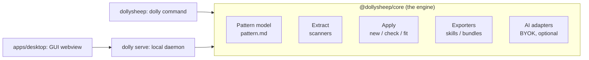

# dolly: Implementation Plan

> The living roadmap. Update the [session log](#session-log) at the end of every working session.

## Vision

dolly saves **project organization patterns** (everything that makes *your* projects yours) and applies them anywhere. A pattern captures anything from a ruff config to an entire architecture: folder layout, naming conventions, dependencies, code style, the natural language your docs are written in, and which programming language a given kind of functionality is written in.

The name is a nod to Dolly the cloned sheep: you clone how you build software.

## Product pillars

1. **Non-declarative capture.** `dolly extract` infers a pattern from a real project deterministically: no annotations, no flags. Declarative statements are a last resort for the few things inference can't reach.
2. **Patterns are plain files you own.** Human-editable, diffable, deletable. No lock-in, no database.
3. **Three ways to apply.** Scaffold a `new` project, `fit` an existing one, or `check`/`--watch` continuously like a linter.
4. **AI is optional, never required.** Everything deterministic works with AI off. With AI on (BYOK), dolly gains semantic placement, cross-language translation, and a passive learning mode.
5. **Patterns travel.** Export as skills/agents for any LLM, or as a `.dolly` bundle to share with your team.

## How visual work happens

A maintainer rule since 2026-08-21: anything a person will look at (the mark, a GUI view, an empty state, installer and docs visuals) is designed before it is built, on a Claude Design canvas (`/design`), and approved there. The canvas is the place to compare directions and tweak by hand; code follows the approved board, and the port is reviewed against it. Canvas links are recorded in [docs/design/gui.md](design/gui.md) so a later session can reopen the source of a screen. The brand sheet and the four app views that the 2026-08-21 redesign shipped from are the first entries. Every milestone below that adds a surface names its design step explicitly. One exception, decided 2026-09-10: a small addition to an approved board that reuses its own components and vocabulary (a button, a toggle, a tile, a row action, a panel in the shape of its neighbors) is ported directly and reviewed live; a new surface still goes to the canvas first.

## Architecture



- **`packages/core`**: all logic. No CLI or GUI concerns ever leak in here.
- **`packages/cli`**: thin commander layer over the engine. Every feature ships here first. `dolly serve` lives here too: the engine's one door for the GUI (design in [docs/design/gui.md](design/gui.md)).
- **`apps/desktop`** (M5): the GUI webview (Vue 3 + Vite), served by the daemon so CLI/GUI parity holds by construction, plus the Tauri shell (`src-tauri/`) that wraps this exact pair: it spawns `dolly serve` and points the window at the tokened URL (steps in `apps/desktop/README.md`).
- **AI adapters** (M7): one provider interface, implementations for Anthropic / OpenAI / Google. Keys in the OS keychain.

## The pattern model

A pattern is a **directory**; sharing one means zipping it (`.dolly` bundle).

```
<name>/
├── pattern.md      # the pattern itself
└── templates/      # optional file templates captured for scaffolding
```

`pattern.md` = YAML frontmatter + Markdown prose (see ADR-0002):

- **Frontmatter**: the *facets* the deterministic engine understands. Grows facet by facet:

  | Facet | Contents | Extract | Check | Scaffold |
  |---|---|---|---|---|
  | `naming` | case conventions for files/dirs, global + per-extension | majority vote | ✓ | ✓ |
  | `layout` | expected paths, required/optional, `{name}` templating | tree generalization + sibling voting | ✓ | ✓ |
  | `toolchain` | package manager, formatter, linter, typechecker, test/task runner, CI + captured config files | fingerprint matrix | ✓ | ✓ |
  | `languages` | sanctioned languages (ordered), runtime version pins, natural language of docs | lookup + corpus vote | ✓ | ✓ |
  | `dependencies` (M1) | libraries by purpose, version policy | manifest parsing + curated registry | ✓ | ✓ |
  | `scaffold` (M3) | file templates + variables | sibling-agreement capture | n/a | ✓ |
  | `commands` (M3) | canonical dev verbs (test, lint, build…) | script/taskfile parsing | ✓ | ✓ |
  | `license` (M3) | SPDX id | manifest field + LICENSE fallback | ✓ | ✓ |
  | `testing` (M4) | test placement + file pattern | placement + naming-shape vote | ✓ | n/a |
  | `commits` (M8) | message style, types, scopes, subject case | git-log vote under ADR-0005's exception | n/a (hooks and exports carry it) | n/a |
  | `releases` (M8) | versioning scheme, changelog style, release tool | tag vote (ADR-0005) + root fingerprints | ✓ (changelog, tool config) | ✓ (changelog header) |

  Extraction rules (the shared inventory, evidence classes, facet-vs-prose
  degradation, and format fluidity until M9) are recorded in
  [ADR-0003](adr/0003-deterministic-extraction.md) and detailed in
  [docs/design/extract.md](design/extract.md).

- **Prose**: the *conventions* only humans and the AI layer can interpret ("raise domain errors, translate to HTTP at the router layer"). The deterministic engine ignores it; exports and AI consume it.

## CLI surface (target)

```
dolly extract [paths...] --name <n> # infer a pattern from a project, or what several agree on (M2, done; several 2026-09-01)
dolly list | show | edit | delete # manage saved patterns               (M0/M1, done)
dolly new <pattern> [dir]         # scaffold a fresh project            (M3, done)
dolly check [--fix] [--watch] [--conventions] # lint-like enforcement; the model reads the prose with AI on (M4, done; conventions 2026-09-10)
dolly serve [--port] [--open]     # local daemon + browser GUI          (M5, done)
dolly fit <pattern> [--apply]     # refit an existing project, dry-run default (M6, done)
dolly export <pattern> [--as t] [--out f] # a .dolly bundle, or a file for Claude, Cursor, Copilot, Gemini, Windsurf, Cline, any agent (M1 + M8, done; five more frames 2026-09-10)
dolly import <file-or-url> [--force] # import a shared pattern         (M1, done; URLs 2026-09-01)
dolly link <pattern> [-C dir] [--vendor] # write the .dolly marker; --vendor copies the pattern into the repo (2026-09-01, done; vendor 2026-09-10)
dolly ignore <paths...> [-C dir]  # add paths to the marker's ignore list (2026-09-10, done)
dolly ai [status|connect|use|off] # BYOK provider setup                 (M7, done)
dolly completions <zsh|bash|fish> # a completion script for the shell  (2026-09-01, done)
dolly learn [pattern] [--once] [--yes] # watch a project, review drafted pattern edits (M7, done)
```

## Milestones

> **Release policy (maintainer decision, 2026-07-24):** the repo goes public on GitHub only once M1 through M8 exist as a complete end-to-end first draft. Until then, everything stays local.

- **M0: Bootstrap** *(done 2026-07-24)*: monorepo (bun + Biome + strict TS), pattern format v1 + local store in `@dollysheep/core`, `dolly list/show/delete/home`, OSS hygiene (LICENSE, README, CONTRIBUTING, CoC, SECURITY, templates), CI, logo, this plan, ADRs 0001 and 0002.
- **M1: Pattern ergonomics** *(done 2026-07-24)*: full v1 facet schemas incl. `dependencies`; `dolly edit` (opens `$EDITOR`, validates on save); great validation errors; `.dolly` bundle import/export (pulled forward from M8).
- **M2: Extract** *(done 2026-07-24)*: the shared inventory walk plus five deterministic scanners (layout sibling-shape voting, naming majority vote, toolchain fingerprint matrix with configs captured as files, dependency manifests + purpose registry, language/runtime detection incl. natural language of docs), one consolidated schema diff (ADR-0003), `dolly extract [path] --name`. Low-confidence findings land in prose as counted notes, not facets. **Acceptance:** extracting from 3 real repos yields patterns a human agrees with after light editing.
- **M3: New** *(done 2026-07-24)*: scaffold a project from a pattern (layout, configs, templates with variable substitution, base-manifest generation, git init). Adds the `commands` facet (canonical dev verbs, written into the scaffolded manifest/taskfile) and the `license` facet (SPDX id; new stamps LICENSE + the manifest field). **Acceptance:** extract from a real repo → `dolly new` → the fresh project passes its own pattern's `check` and its linter, and runs its canonical commands.
- **M4: Check** *(done 2026-08-11)*: rule engine mapping facets to violations with autofixes; `--fix`; `--watch` via fs events. Adds the `testing` facet (placement + file pattern), `toolchain.hooks` (husky/lefthook/pre-commit), the built-in env-hygiene rule (".env present but not gitignored"), the per-config binding modes (subset by default, verbatim opt-in via `toolchain.binding`), and the `.dolly` marker `dolly new` writes so `check` knows its pattern. **Acceptance:** seeded violations are found and fixed idempotently (fixing twice changes nothing).
- **M5: GUI shell** *(done: web-first 2026-08-12, Tauri wrap 2026-08-13)*: pattern library, pattern viewer/editor, project check dashboard, all in a Vue 3 + Vite webview reaching the engine only through the thin local daemon (`dolly serve`), white/black/grey sheep theme, wrapped in a Tauri window that spawns the daemon and dies with it. Still owed to the shell, at release time: directory pickers (which is when extract/new/import/export join the daemon protocol) and a compiled daemon bundled as a true sidecar (today the shell presumes a checkout with `bun`). **Acceptance:** browse, edit, and check visually; met in a browser end to end, then re-met in the native window.
- **M6: Fit** *(done 2026-08-13)*: migration planner (moves, renames, config merges) → dry-run diff → apply. Git safety: refuses a dirty tree, creates a checkpoint branch (`git switch` back is the undo), commits the applied plan. One maintainer decision shapes v1 ([docs/design/fit.md](design/fit.md)): relative TS/JS imports are rewritten where resolution is unambiguous; a move fit cannot account for degrades to report-only with its reason. **Its first PR (the structural refactor the 2026-08-11 architecture review sequenced here) landed the same day, before any fit logic:** check's fixes are serializable data (a create/append/merge `FixPlan` behind the one executor in `check/fix.ts`, plus `write` for the verbatim binding) with rules behind the single `Rule` contract in `check/rules/`, which is what gives fit its dry-run diff and the M5 daemon a JSON-safe `CheckReport`; the shared tree/serialization/content helpers live in named modules (`tree/`, `serialize.ts`, `apply/content.ts`); the taskfile recipe scanner is unified in `taskfile.ts`; `layout.ts` has direct unit tests so its voting constants are falsifiable. **Acceptance:** refit a deliberately messy repo; every change previewed first; fully revertible.
- **M7: AI layer** *(done 2026-08-22: foundation, placement, learning mode, translation, and the GUI's learn and AI settings surfaces)*. Provider adapters (Anthropic / OpenAI / Google), keychain storage, intelligent apply (semantic file placement done; cross-language translation when the pattern dictates a language, scoped 2026-08-22 as full translation behind apply, [ADR-0004](adr/0004-translation-behind-apply.md) and [docs/design/translation.md](design/translation.md)), learning mode (`dolly learn`, done: a watcher drafts pattern edits the user reviews as a diff). AI is strictly additive. Both GUI surfaces went through the canvas first (the learn view and the AI settings), and the fit view renders translate steps and the verification verdicts.
- **M8: Exports** *(done 2026-08-22: engine, CLI, daemon, and the GUI's export view, designed on the canvas first)*. `claude-skill`, `cursor` rules, `AGENTS.md`, generic system prompt, one brief in four frames ([docs/design/exports.md](design/exports.md)). (Bundle import/export moved to M1.) Adds the facets exports feed on most: `commits` (message grammar voted from git log under [ADR-0005](adr/0005-history-facets.md), the exception to ADR-0003) and `releases` (versioning scheme, changelog style, release tool); `naming.branches` was deferred, since one clone's local refs are not evidence of a convention. Design step: the **export view** on the canvas (pick a target, preview the rendered file, save or copy), approved and ported the same day.
- **M9: Going public & v0.1** *(the GUI's share done 2026-08-23: the native shell's pickers and the extract, new, import, and bundle export flows, designed on the canvas then ported; the release mechanics done 2026-09-10: the binary and the npm bundle embed the GUI, the Tauri shell spawns the compiled daemon as its sidecar, Windows keys seal through DPAPI, the format bump discipline is written down, and a tag builds the binaries, the installers and the npm package through [.github/workflows/release.yml](../.github/workflows/release.yml), with the steps in [docs/RELEASING.md](RELEASING.md); what remains is the maintainer's: the first public push, the v0.1.0 tag, the Homebrew tap, docs visuals)*. First public GitHub push, `bun build --compile` binaries (macOS/Linux/Windows), npm + Homebrew distribution, Tauri installers, docs polish, demo GIF, name-collision check on registries, v0.1.0 release. Design steps, each on the canvas first: the **native shell's directory pickers and the extract, new, import and export flows** they unlock (M5's debt), the **README and docs visuals** (hero, the demo's storyboard, social preview card), and the **installer and store assets** for the Tauri builds.

## After v0.1: the gaps and their plans

Six things the 2026-09-10 evaluation found missing and deliberately left for after the first release, each with the shape of its fix so a session can pick one up cold. Order is by value; none blocks going public.

### The engine on npm (`@dollysheep/core`)

Today `dollysheep` bundles the engine in, so nobody can `import { extractPattern } from "@dollysheep/core"`; editors and other tools have no door but the CLI and the daemon. Plan: a library build, `bun build --target=bun --packages=external packages/core/src/index.ts --outdir packages/core/dist` for the code and `tsc --emitDeclarationOnly` (a small tsconfig beside it) for the types; `exports` pointing at `dist/index.js` with `types`, `files: ["dist"]`, the runtime dependencies staying dependencies; the barrel stays the public API (it already is the one door, docs/design/gui.md). The release workflow publishes core before the CLI, RELEASING.md gains the step, and the CLI keeps bundling it so nothing at runtime couples the two. Acceptance: `bun add @dollysheep/core` in a scratch project, `extractPattern` runs on a fixture with types resolving. Half a day.

### GUI tests in CI

Only the markdown renderer has tests; the seven views were walked by hand. Plan: Playwright (`@playwright/test`, Chromium only) under `apps/desktop/e2e/`, a global setup that seeds a temp `DOLLY_HOME` with `dolly extract` on a fixture and starts `dolly serve --port 0`, and one spec per view opening the tokened URL and walking library → pattern (overview, source, a captured file tab) → check (run, ignore, fix) → fit (plan) → export (preview) → settings, asserting text and zero console errors, the same walk the sessions do by hand. CI's quality job runs it on Ubuntu after the webview build (`npx playwright install --with-deps chromium`). Acceptance: a broken view fails the job. A day; keep each spec short.

### Editing the marker from the GUI and the CLI

The check view adds an ignore but cannot remove one, and `rules` are hand-edited only. Plan: one engine function `editMarker(dir, { ignore?, rules? })` beside `ignorePaths` (which becomes a call to it), `dolly ignore --remove <paths...>` and a small `dolly rules <rule>=<on|warn|off>` verb, `POST /api/marker` carrying the whole marker, and a Marker panel under the check view's toolbar (the ignore entries with a remove action, the ten rules as a three-state row), a board first since it is a new panel. Acceptance: the marker round-trips through the panel, check re-runs after each change, the verbs write the same bytes. A day including the board.

### The layout budget and required entries

The 50-entry budget drops optional entries only, so a `{name}` group with many required core files pushes a pattern past it (Humanizer: 98 after the identity fix). Plan: budget a group's core too, keeping its first N core entries by support then path (N = 8, a `LAYOUT_TUNING` constant) and turning the rest into one counted note ("12 more files every member carries; add them by hand"); check and new read the same entries, so nothing else moves. Acceptance: Humanizer's pattern fits the budget, and `layout.test.ts` pins the group cap. Two hours.

### Toolchain detection below the root

A repository of samples or a monorepo without a root manifest (ktor-samples) extracts as whatever language dominates by bytes and scaffolds a JavaScript project. Plan: when the root carries no manifest, run the toolchain fingerprints over the workspace members or the first-level directories that carry one and vote, with `agreement.ts`'s machinery applied to subtrees: a tool a majority of members share becomes the facet, the note names the members that disagree, and the primary ecosystem follows the same vote; `new` then refuses to invent a root manifest for a pattern whose ecosystem came from members, and says so. Acceptance: ktor-samples extracts `toolchain.packageManager: gradle` and its scaffold carries no `package.json`. A day.

### Pruning the URL-source stores

A pattern fetched for a `source:` URL lands under the system temp directory once per URL and is never removed. Plan: keep the stores under `<dollyHome>/sources/<hash>` with a fetched-at stamp, reuse a copy younger than an hour and refetch otherwise (a `sha256:` pin makes the reuse safe), and give `dolly home` a `--prune` that removes sources older than a week. Acceptance: two checks in a row fetch once, and `dolly home --prune` empties the directory. Two hours.

## Risks

| Risk | Mitigation |
|---|---|
| Refit deletes/moves the wrong thing | Dry-run by default, git-clean requirement, checkpoint branch (M6) |
| "dolly" name taken on npm/registries | Decided 2026-09-01: the npm package is `dollysheep` (`@dollysheep/core` for the engine), the bin stays `dolly`, and the Homebrew formula is `dolly` (free) |
| API keys leaking | OS keychain only, never config files; keys never enter patterns or exports |
| Scope creep | Facet-by-facet discipline; every milestone has acceptance criteria |
| bun-compiled binaries vs native deps | Prefer pure-TS/WASM deps (e.g. web-tree-sitter if ASTs are ever needed) |
| Windows path/fs quirks | CI test matrix includes Windows from day one |

## Prior art (and why dolly is different)

cookiecutter/copier scaffold from hand-written declarative templates; projen manages config declaratively; nx generators are ecosystem-bound; ruff/eslint enforce single-language style. dolly's bet is the combination: **extraction instead of declaration**, the full lifecycle (new/fit/check) instead of scaffold-only, cross-ecosystem patterns, and optional AI on top of a deterministic core.

## Decisions

Recorded as ADRs in [`docs/adr/`](adr/): [0001, TypeScript + bun + Tauri stack](adr/0001-typescript-bun-tauri-stack.md), [0002, pattern as Markdown document](adr/0002-pattern-as-markdown-document.md), [0003, the deterministic extraction contract](adr/0003-deterministic-extraction.md), [0004, cross-language translation behind apply](adr/0004-translation-behind-apply.md), [0005, the history facets and the exception they carve](adr/0005-history-facets.md).

## Session log

The session log lives in [docs/log.md](log.md), one entry per working session, newest last; add one at the end of every session.
